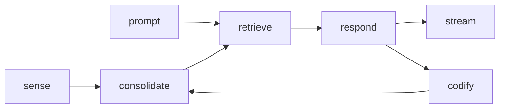

# Host & Services

The **Engramic Inference Engine** consists of several services, each designed to facilitate distinct aspects of knowledge processing.

## Host

The **Host** contains all of the executing services on the instance/machine. You may add all services or just one. The host manages initialization and the set of resources and capabilities used by all other systems. The Host is like a very lightweight abstraction layer for all services.

## Services

- **Retrieve**: Analyzes the prompt, manages short-term memory, and performs retrieval of all engrams.
- **Respond**: Constructs the response to the user.
- **Codify**: While in training mode, assesses the validity of responses, integrating them as long-term memories.
- **Consolidate**: Transforms data into observations, contained knowledge units rich in context.
- **Sense**: Converts raw data into observations.

## Centralized Services

- **Store**: Centralized storage for long-term, context-aware memory.
- **Message**: Centeralized message passing between all services.
- **Process**: Centralized progress tracking from input (e.g. prompt or document) to inserting into Retrieve.

## Services In Development

- **Teach**: Encourages the emergence of new engrams by stimulating connections between existing ones.

