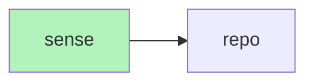

# Load And Query a Repo



A repo is collection of files located at a root folder. The RepoService provides the following abilities:

- Returns the set of all root folders.
- Returns all files within each root folder.
- Enables prompting filtering by repo.

## Example Code

The full code is avaiable in the source code at ```/engramic/examples/repo/repo.py```

In order to run the code, you must add the REPO_ROOT environment variable. For example, you can set repo root to a path like the following: ```REPO_ROOT = "~/.local/share/engramic/"```.

Take a look at the RepoService's start code:

```
    def start(self):
        super().start()
        self.subscribe(Service.Topic.MAIN_PROMPT_COMPLETE, self.on_main_prompt_complete)
        self.subscribe(Service.Topic.REPO_FOLDERS, self._on_repo_folders)
        self.subscribe(Service.Topic.REPO_FILES, self._on_repo_files)
        self.subscribe(Service.Topic.DOCUMENT_INSERTED, self.on_document_inserted)
        repo_service = self.host.get_service(RepoService)
        repo_service.scan_folders()
        self.run_task(self.submit_documents())
```

The MAIN_PROMPT_COMPLETE event is triggered when a prompt has been run.

The REPO_FOLDERS event is triggered when scan_folders is called. It lists all of the folders in the REPO_ROOT.

The REPO_FILES event is triggered after REPO_FOLDERS are discovered.

The DOCUMENT_INSERTED event is triggered after the document has been processed and it is available for retrieval.

### Filtering
This prompt will access files from both repo_id1 and repo_id2.

```prompt1 = Prompt(
    'This is prompt 1. Tell me about document content.',
    repo_ids_filters=[self.repo_id1, self.repo_id2],
)```

#### Filter by a single repo
This prompt will only access files from repo_id1.

```prompt2 = Prompt(
    'This is prompt 2. Tell me about document content.',
    repo_ids_filters=[self.repo_id1],
)```

#### The 'Null' repo

Documents are usable without using the repo system. In this case, the file is associated with a default repo known as the 'null' repo.

```prompt3 = Prompt(
    'This is prompt 3. Tell me about document content.',
    repo_ids_filters=None,
)```

#### Empty List (invalid)

❌  **Invalid** - Empty list repo filters are not allowed and will throw an error.

 ```Prompt('This is prompt 4. Tell me about document content.', repo_ids_filters=[])```


### Important Considerations.
- For security purposes, there is no ability to access all repos without explicitly providing each repo id as a filter.
- If you load a document under a repo, it is forever in that repo. For example, if you first scan a document under the 'null' repo and then scan that document as part of a repo it will be detected and not scanned. Because of this, when you query the repo, it will not display results as part of the repo because it is part of the 'null' repo.
