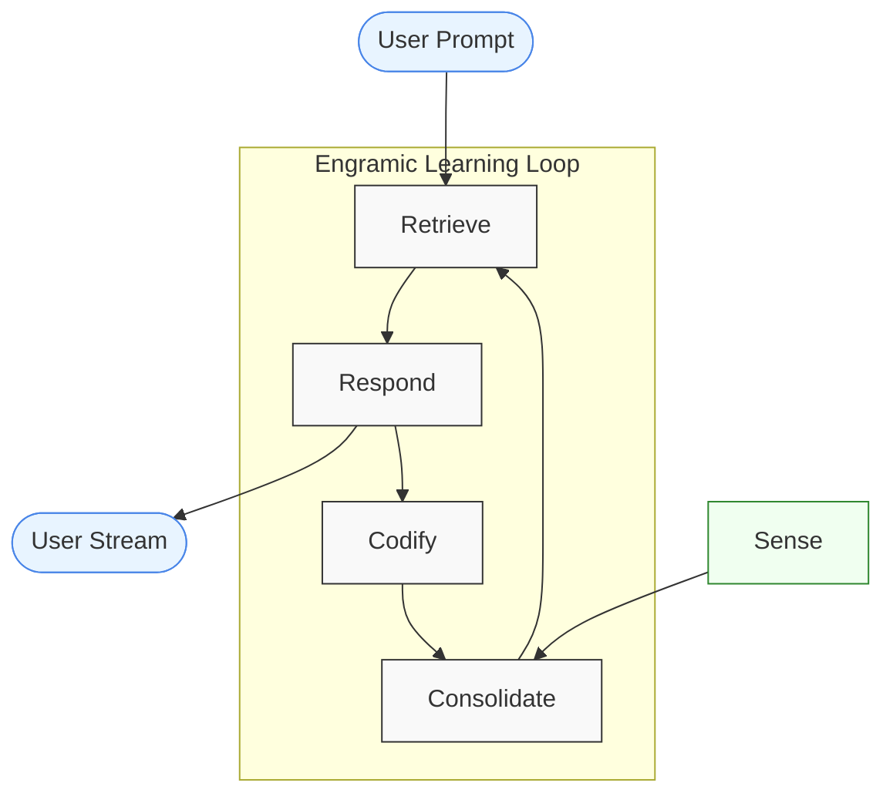

# Documents

*note: Engramic currently only supports PDFs*



PDF parsing is part of the sense service. When a document is parsed, it is sent to the consolidate service where it is processed and passed to retrieval for storing in a vector database and to response if it is matched semantically.

## Example Code Walkthrough

The full code is available in the source code at `/engramic/examples/document/document.py`. 
You can download the files for this exercise at https://www.engramic.org/assets-page

Let's walk through how this example works step-by-step:

### 1. Setting Up the Environment

The example code creates a `TestService` class that demonstrates how to:

- Submit a document for processing
- Listen for document processing completion
- Query the system about the processed document

### 2. Document Submission Process

```python
# In TestService.start():
sense_service = self.host.get_service(SenseService)
document = FileNode(
    FileNode.Root.RESOURCE.value, 'engramic.resources.rag_document', 'IntroductiontoQuantumNetworking.pdf'
)
self.document_id = document.id
sense_service.submit_document(document)
```

This code:

1. Gets a reference to the SenseService
2. Creates a Document object using a PDF from the resources directory
3. Saves the document ID for later reference
4. Submits the document to the SenseService for processing

### 3. Document Processing Flow

When a document is submitted, the following happens:

#### Sense Service
- Convert PDF page to PNGs
- Extract meta data from first few pages
- Convert from image into annotated text
- Summarize annotated text for Meta object
- Parse from annotated text into Engrams
- Package into an observation (Meta + Engrams)

#### Event Handling

The TestService subscribes to two key events:
```python
self.subscribe(Service.Topic.MAIN_PROMPT_COMPLETE, self.on_main_prompt_complete)
self.subscribe(Service.Topic.DOCUMENT_INSERTED, self.on_document_inserted)
```

- `DOCUMENT_INSERTED`: Triggered when document processing is complete
- `MAIN_PROMPT_COMPLETE`: Triggered when a response to a prompt is ready

### 4. Querying the Document

When the document is fully processed (`DOCUMENT_INSERTED` event), the code automatically sends a query:

```python
def on_document_inserted(self, message_in: dict[str, Any]) -> None:
    document_id = message_in['id']
    if self.document_id == document_id:
        retrieve_service = self.host.get_service(RetrieveService)
        prompt = Prompt('Do you have any files about quantum networking? What is it about?')
        retrieve_service.submit(prompt)
```

This:

1. Checks if the completed document is the one we submitted
2. Gets a reference to the RetrieveService
3. Creates a prompt asking about quantum networking
4. Submits the prompt to the RetrieveService

### 5. Handling the Response

When the response is ready (`MAIN_PROMPT_COMPLETE` event), the code logs it:

```python
def on_main_prompt_complete(self, message_in: dict[str, Any]) -> None:
    response = Response(**message_in)
    logging.info('\n\n================[Response]==============\n%s\n\n', response.response)
```

### Document Submission Options

To submit a document for processing, you can use the submit_document method from the SenseService (as shown in the example) or via the Document.Topic.SUBMIT_DOCUMENT message.

When submitting documents that may have been processed before, you can use the overwrite parameter to force reprocessing:

```
# Submit multiple documents with overwrite option
repo_service.submit_ids([document_id1], overwrite=True)

# Submit without overwrite (uses cached version if available)
repo_service.submit_ids([document_id2])
```

### Loading From Data Directory

In the example above, the code is referencing a file saved in the resources directory, which is packaged with the distribution (src/engramic/resources). If you would like to load a file that isn't a resource, you can pass Document.Root.DATA.value to the first parameter of Document which will set a base directory to the REPO_ROOT environment variable.

```
# Loading from local data directory
document = FileNode(
    FileNode.Root.DATA.value,
    '/path/to/document/folder',
    'document.pdf'
)
```

Example of setting REPO_ROOT environment variable.
```
REPO_ROOT = "~/.local/share/engramic/"
```