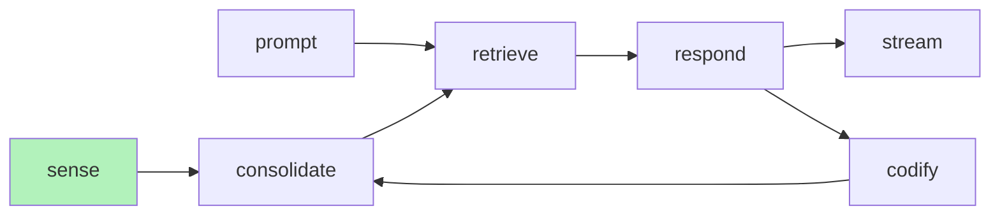

# PDF Parse



PDF parsing is part of the sense service. When a document is parsed, it is sent to the consolidate service where it is processed and passed to retrieval for storing in a vector database and to response if it is matched semantically.

## Example Code

The full code is avaiable in the source code at ```/engramic/examples/document/document.py```

??? note "Imports and logging config."
    ```
    import logging
    from typing import Any

    from engramic.application.codify.codify_service import CodifyService
    from engramic.application.consolidate.consolidate_service import ConsolidateService
    from engramic.application.message.message_service import MessageService
    from engramic.application.progress.progress_service import ProgressService
    from engramic.application.response.response_service import ResponseService
    from engramic.application.retrieve.retrieve_service import RetrieveService
    from engramic.application.sense.sense_service import SenseService
    from engramic.application.storage.storage_service import StorageService
    from engramic.core.document import Document
    from engramic.core.host import Host
    from engramic.core.prompt import Prompt
    from engramic.core.response import Response
    from engramic.infrastructure.system import Service

    logging.basicConfig(level=logging.INFO, format='%(asctime)s - %(levelname)s - %(message)s')
    ```

??? note "The Test Service"
    ```
    # This service is built only to subscribe to the main prompt completion message.
    class TestService(Service):
        def start(self):
            super().start()
            self.subscribe(Service.Topic.MAIN_PROMPT_COMPLETE, self.on_main_prompt_complete)
            self.subscribe(Service.Topic.INPUT_COMPLETED, self.on_input_complete)

            sense_service = self.host.get_service(SenseService)
            document = Document(Document.Root.RESOURCE, 'engramic.resources.job_descriptions', 'GH SC Official Job Descriptions.pdf')
            self.document_id = document.id
            sense_service.submit_document(document)


        def on_main_prompt_complete(self, message_in: dict[str, Any]) -> None:
            response = Response(**message_in)
            logging.info('\n\n================[Response]==============\n%s\n\n', response.response)

        def on_input_complete(self, message_in: dict[str, Any]) -> None:
            input_id = message_in['input_id']
            if self.document_id == input_id:
                retrieve_service = self.host.get_service(RetrieveService)
                prompt = Prompt('List the roles at GH Star Collector.')
                retrieve_service.submit(prompt)

    ```

The TestService is small service whose pupose is to run the example. It subscribes to MAIN_PROMPT_COMPLETE which is sent by the Response Service when the response is complete. INPUT_COMPLETED tells us when our document is complete, a process which includes the following steps:

### Sense Service
- Convert PDF page to PNGs
- Extract meta data from first few pages
- Convert from image into annotated text
- Summarize annotated text for Meta object
- Parsed from annotated text into Engrams
- Packaged into an observation (Meta + Engrams)

### Consolidate Service
- Unpackage observation
- Generate indices for meta and engrams
- Generate embeddings
- Save meta and engrams
- Send meta and engrams index to retrieve to store in meta and engrams vector databases.

??? note "Main"
    ```
    def main() -> None:
        host = Host(
            'standard',
            [
                MessageService,
                SenseService,
                RetrieveService,
                ResponseService,
                StorageService,
                ConsolidateService,
                CodifyService,
                ProgressService,
                TestService,
            ],
        )

        # The host continues to run and waits for a shutdown message to exit.
        host.wait_for_shutdown()


    if __name__ == '__main__':
        main()
    ```

The code in the section simple adds all services into the Host. (note: Codify isn't actually used in the example.)


## Loading From Data Dir

The document object is passed to the SenseService and defines the file or resource path and the file name. In the exmample above, the code is referencing a file saved in the resources directory, which is packaged with the distribution. If you would like to load a file that isn't part of the resources, you can choose Document.Root.DATA which will set a base directory of ~.local/share/engramic

Note: Windows and MacOS is not tested at this time.