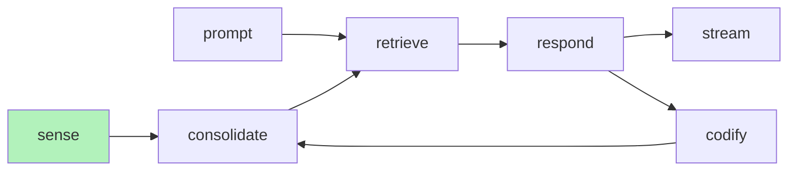

# Documents

*note: Engramic currently only supports PDFs*



PDF parsing is part of the sense service. When a document is parsed, it is sent to the consolidate service where it is processed and passed to retrieval for storing in a vector database and to response if it is matched semantically.

## Example Code

The full code is avaiable in the source code at ```/engramic/examples/document/document.py```

The TestService is small service whose pupose is to run the example. It subscribes to MAIN_PROMPT_COMPLETE which is sent by the Response Service when the response is complete. DOCUMENT_INSERTED tells us when our document is complete, a process which includes the following steps:

The DOCUMENT_INSERTED event is generated by the ProgressService and must be included in the host.

### Sense Service
- Convert PDF page to PNGs
- Extract meta data from first few pages
- Convert from image into annotated text
- Summarize annotated text for Meta object
- Parsed from annotated text into Engrams
- Packaged into an observation (Meta + Engrams)

### Document Submission
To submit a document for processing, you can use the submit_document method from the SenseService (as shown in the example) or via the Document.Topic.SUBMIT_DOCUMENT message.

When submitting documents that may have been processed before, you can use the overwrite parameter to force reprocessing:

```
# Submit multiple documents with overwrite option
repo_service.submit_ids([document_id1], overwrite=True)

# Submit without overwrite (uses cached version if available)
repo_service.submit_ids([document_id2])
```

### Loading From & Data Dir

In the exmample above, the code is referencing a file saved in the resources directory, which is packaged with the distribution (src/engramic/resources). If you would like to load a file that isn't a resource, you can pass Document.Root.DATA.value to the first parameter of Document which will set a base directory of ~.local/share/engramic

```
# Loading from local data directory
document = Document(
    Document.Root.DATA.value,
    '/path/to/document/folder',
    'document.pdf'
)
```