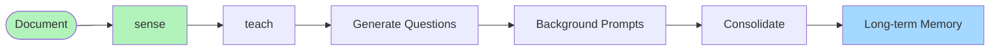

# Run A Lesson



### Teach Example

The full code is avaiable in the source code at ```/engramic/examples/teach/teach.py```

To add lesson functionality to your Engramic application:

1. Include the TeachService in your host initialization:

    ```python
    host = Host(
        'standard',
        [
            # Other services...
            TeachService,
            # Other services...
        ],
    )
    ```

2. Submit a document to trigger the lesson process:

    ```python
    sense_service = host.get_service(SenseService)
    document = Document(
        Document.Root.RESOURCE.value, 
        'engramic.resources.your_document_path', 
        'YourDocument.pdf'
    )

    sense_service.submit_document(document, True)
    ```

3. Listen for lesson events if needed:

    ```python
    # Subscribe to lesson events
    self.subscribe(Service.Topic.LESSON_CREATED, self.on_lesson_created)
    self.subscribe(Service.Topic.LESSON_INSERTED, self.on_lesson_inserted)
    ```

### How It Works

The TeachService provides an automated way to enhance the system's understanding of documents by running a "lesson" that explores content more deeply. Here's how it works:

- **Document Submission**: When a document is submitted to the system, the SenseService processes it and inserts it into the vector database.
- **Meta Creation**: During processing, the system creates a meta object that describes the structure of the document.
- **Lesson Initiation**: Once the document is inserted, TeachService automatically creates and runs a lesson based on the document's meta information.
- **Question Generation**: The lesson uses an LLM to generate relevant questions about the document content.
- **Background Learning**: These questions are submitted as prompts that run in the background with training_mode=True and is_lesson=True flags.
- **Knowledge Consolidation**: The responses to these prompts are converted into long-term memories, creating a deeper understanding of the document.
- **Enhanced Q&A**: Once the lesson completes, the system provides more robust answers to user questions about the document's content.