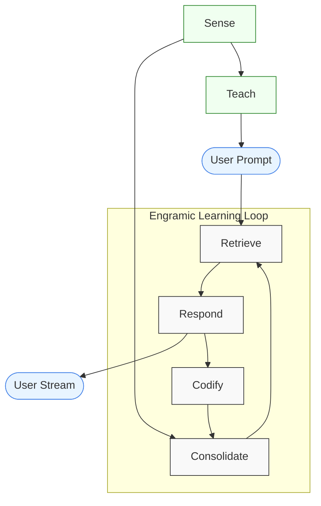

# Run A Lesson



## Example Code Walkthrough

The full code is available in the source code at `/engramic/examples/teach/teach.py`. 
You can download the files for this exercise at https://www.engramic.org/assets-page

Let's walk through how this example works step-by-step:

### 1. Setting Up the Environment

The example code creates a `TestService` class that demonstrates how to:
- Submit a document for processing
- Listen for lesson events
- Process lesson results
- Query the system after the lesson completes

### 2. Initializing Required Services

```python
def main() -> None:
    host = Host(
        'standard',
        [
            MessageService,
            SenseService,
            RetrieveService,
            ResponseService,
            StorageService,
            ConsolidateService,
            CodifyService,
            TeachService,  #<-- This is the key service for lessons
            RepoService,
            ProgressService,
            TestService,
        ],
    )
```

This code sets up all necessary services, with `TeachService` being essential for the lesson functionality.

### 3. Document Submission Process

```python
# In TestService.start():
sense_service = self.host.get_service(SenseService)
document = FileNode(
    FileNode.Root.RESOURCE.value, 'engramic.resources.rag_document', 'IntroductiontoQuantumNetworking.pdf'
)
self.document_id = document.id
sense_service.submit_document(document, overwrite=True)
```

This code:

1. Gets a reference to the SenseService
2. Creates a Document object using a PDF from the resources directory
3. Saves the document ID for later reference
4. Submits the document to the SenseService for processing with overwrite=True to ensure fresh processing

### 4. Lesson Event Handling

The TestService subscribes to key events related to lessons:

```python
self.subscribe(Service.Topic.MAIN_PROMPT_COMPLETE, self.on_main_prompt_complete)
self.subscribe(Service.Topic.LESSON_CREATED, self.on_lesson_created)
self.subscribe(Service.Topic.LESSON_INSERTED, self.on_lesson_inserted)
```

- `LESSON_CREATED`: Triggered when a new lesson is created
- `LESSON_INSERTED`: Triggered when a lesson is fully processed and ready for retrieval
- `MAIN_PROMPT_COMPLETE`: Triggered when a response to a prompt is completed.

### 5. Tracking Lesson Progress

The service keeps track of lesson IDs and handles lesson-related events:

```python
def on_lesson_created(self, message_in: dict[str, Any]) -> None:
    self.lesson_id = message_in['id']

def on_main_prompt_complete(self, message_in: dict[str, Any]) -> None:
    response = Response(**message_in)
    if not response.prompt['is_lesson']:
        logging.info('\n\n================[Response]==============\n%s\n\n', response.response)
    else:
        logging.info('Lesson Response. %s', response.prompt['prompt_str'])
```

This code:
1. Stores the lesson ID when created
2. Distinguishes between regular prompt responses and lesson-related responses

### 6. Querying After Lesson Completion

When the lesson is fully processed (`LESSON_INSERTED` event), the code automatically sends a query:

```python
def on_lesson_inserted(self, message_in: dict[str, Any]) -> None:
    lesson_id = message_in['id']
    if self.lesson_id == lesson_id:
        retrieve_service = self.host.get_service(RetrieveService)
        retrieve_service.submit(Prompt('Please tell me about the file IntroductiontoQuantumNetworking.pdf'))
```

This:
1. Checks if the completed lesson is the one we're tracking
2. Gets a reference to the RetrieveService
3. Creates a prompt asking about the document
4. Submits the prompt to the RetrieveService to test knowledge gained from the lesson

## How It Works

The TeachService provides an automated way to enhance the system's understanding of documents by running a "lesson" that explores content more deeply. Here's how it works:

- **Document Submission**: When a document is submitted to the system, the SenseService processes it and inserts it into the vector database.
- **Meta Creation**: During processing, the system creates a meta object that describes the structure of the document.
- **Lesson Initiation**: Once the document is inserted, TeachService automatically creates and runs a lesson based on the document's meta information.
- **Question Generation**: The lesson uses an LLM to generate relevant questions about the document content.
- **Background Learning**: These questions are submitted as prompts that run in the background with training_mode=True and is_lesson=True flags.
- **Knowledge Consolidation**: The responses to these prompts are converted into long-term memories, creating a deeper understanding of the document.
- **Enhanced Q&A**: Once the lesson completes, the system provides more robust answers to user questions about the document's content.

## Adding Lesson Functionality to Your Application

To add lesson functionality to your Engramic application:

1. Include the TeachService in your host initialization:

    ```python
    host = Host(
        'standard',
        [
            # Other services...
            TeachService,
            # Other services...
        ],
    )
    ```

2. Submit a document to trigger the lesson process:

    ```python
    sense_service = host.get_service(SenseService)
    document = FileNode(
        FileNode.Root.RESOURCE.value, 
        'engramic.resources.your_document_path', 
        'YourDocument.pdf'
    )

    sense_service.submit_document(document, True)
    ```

3. Listen for lesson events if needed:

    ```python
    # Subscribe to lesson events
    self.subscribe(Service.Topic.LESSON_CREATED, self.on_lesson_created)
    self.subscribe(Service.Topic.LESSON_INSERTED, self.on_lesson_inserted)
    ```