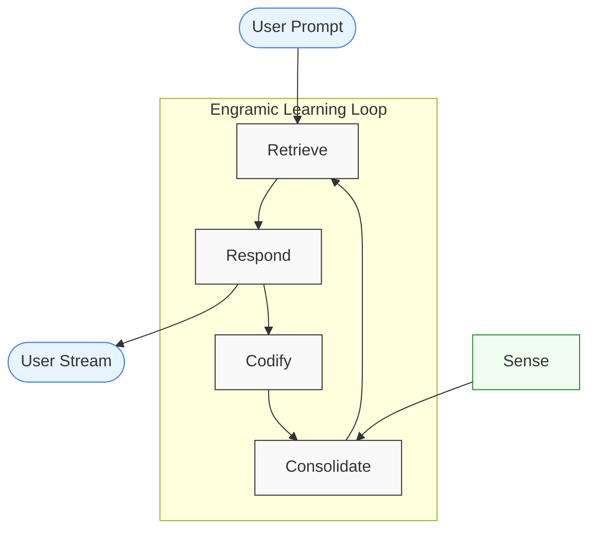

# Engramic API Reference

  

Engramic is an inference engine. It's special because it natively supports long-term, contextual memory. This specialty makes it very adept at building applications that need to perform reliable question and answer over a corpus of data over time. Additionally, long-term, contextual memory provides the means for basic learning capabilities, resulting in deeper, more thoughtful responses.

---

Engramic is pre-alpha. It's a great time to start working with these core systems for some developers, but we have yet to complete many important features. In other words, use of this code base will require some development experience and the ability to work in maturing environments. The flip side, is that a new community is forming and as a pioneer, you have an opportunity to get in early so that you can someday tell your friends, *I used Engramic before it was cool*.

There is currently no support for the following:

- There is no support for individual users.
- There is no HTTP(s) interface at this time.
- There are no fallbacks if API calls fail.
- Windows and MacOS is not being tested as part of our release process.

These features, along with others, will be available in the near future.

What Engramic is ready for:

- Proof of concepts focused on folder directories with 10 or so PDFs with less than 100 pages.
- Research related to long term memory.
- Developers looking to support Engramic.

---

For an evergreen overview of Engramic, visit our online [Knowledge Base](https://www.engramic.org/knowledge-base).

## Introduction to Engramic

*Engramic's core services. Engramic uses a learning loop, building memories from responses and responses from memories*.

### Why Engramic?

Engramic is designed to learn from your unstructured, proprietary data using any large language model (LLM). Understanding comes from synthesizing the information, asking questions, identifying what’s meaningful, and connecting it to prior knowledge and related context. Learning is an iterative process—not a linear one. That’s why we believe a large context window alone doesn’t solve the challenge of truly understanding a dataset. This belief, shaped by two years of research, is what inspired Engramic’s design.

---

### Engramic Architecture Philosophy

- **Modular**  
  The plugin system allows easy switching between LLMs, databases, vector databases, and embedding tools.

- **Scalable**  
  Built as a set of independent services, Engramic can run on a single machine or be distributed across multiple systems.

- **Fast**  
  Optimized for usage patterns involving many blocking API calls, ensuring responsive performance.

- **Extensible**  
  Easily create custom services or plugins to extend functionality.

---

### Engramic Core Concepts

- **Memory**  
  Supports both short-term and long-term memory mechanisms.

- **Engram**  
  The fundamental unit of information, which includes content and base and customizable contextual metadata

- **Citable Engrams**  
  External documents or media that are directly referenced. Citable Engrams are high-fidelity textual representations of the media.

- **Long-Term Memory Engrams**  
  Constructed from one or more Citable Engram or other Long-Term Memory Engrams.

- **Procedural Memory Engrams**  
  Import on server startup, provide prompt based instructions triggered by commands and modified by prompts.

- **Learning**  
  Built through the combination of memory, citable external sources, and user interaction or input.

- **Unified Memory**  
  All engrams are stored within a unified system, enabling both full and selective access to memory content.

